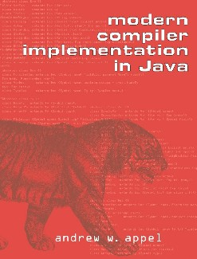

# Tiger

An educational compiler for Java.

## Topic

### Lexer and Parser

### AST and Type Checker

### Intermediate Representation

### Instruction Selection

### Register Allocation

### Garbage Collector

### Static Single Assignment

## Reference
https://www.cs.princeton.edu/~appel/modern/java/